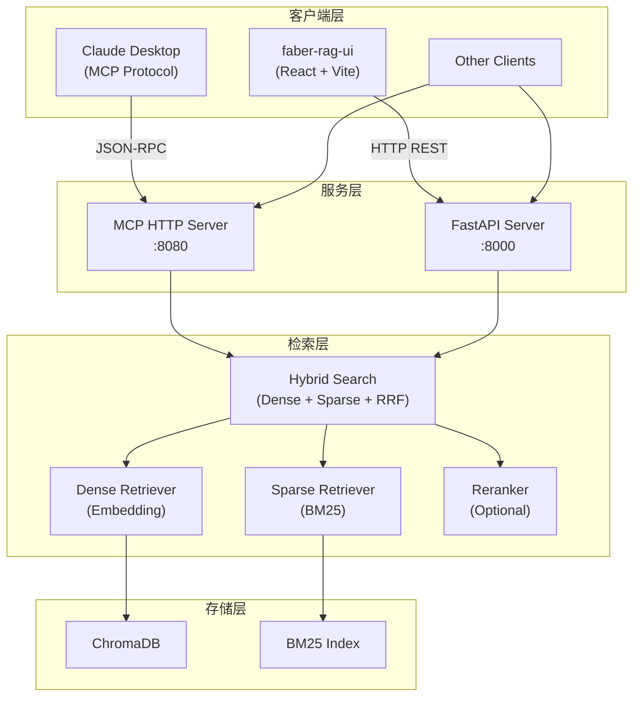

# Faber RAG

模块化 RAG（Retrieval-Augmented Generation）系统，通过 MCP（Model Context Protocol）协议为 AI 客户端提供知识检索服务。

后端采用 **Python** 实现核心检索与文档处理引擎，提供 MCP HTTP Server 与 FastAPI REST API 两种服务入口。前端为独立的 **React + Vite + Tailwind CSS** 管理控制台（位于 `faber-rag-ui`）。

---

## 架构概览



### 核心特性

- **混合检索**：Dense（向量语义搜索）+ Sparse（BM25 关键词搜索）+ RRF 融合，兼顾语义理解与关键词精确匹配
- **多 LLM 支持**：OpenAI、Azure OpenAI、Ollama、DeepSeek、通义千问（Qwen）
- **多模态文档处理**：支持 PDF/Word/Markdown/图片，自动提取文本与图片，支持 Vision LLM 生成图片描述
- **智能分块**：递归分块 + LLM 分块精化 + Metadata 自动增强
- **Rerank 重排序**：可选 Cross-Encoder / LLM 重排序
- **RAG 评估**：内置 RAGAS / DeepEval / Custom 评估框架
- **可观测性**：全链路 Trace 追踪，记录每个检索/生成阶段的耗时与中间结果
- **MCP 协议兼容**：支持 Claude Desktop 等 MCP 客户端直接调用

---

## 技术栈

| 层级 | 技术 |
|------|------|
| 后端语言 | Python 3.10+ |
| API 框架 | FastAPI + Uvicorn |
| 协议 | MCP (Model Context Protocol) |
| 向量数据库 | ChromaDB |
| 稀疏检索 | BM25 (jieba + rank-bm25) |
| 文本分块 | LangChain Text Splitters |
| 文档解析 | MarkItDown |
| 前端 | React 18 + Vite + Tailwind CSS + TypeScript |

---

## 目录结构

```
faber-rag/
├── config/
│   └── settings.yaml          # 主配置文件
├── src/
│   ├── api/
│   │   ├── server.py          # FastAPI 服务入口
│   │   └── services/          # API 业务层 (Data / Trace / Config)
│   ├── core/
│   │   ├── query_engine/      # 混合检索引擎
│   │   ├── response/          # 响应组装 (引用 / 多模态)
│   │   ├── settings.py        # 配置解析
│   │   └── trace/             # Trace 追踪系统
│   ├── ingestion/
│   │   ├── pipeline.py        # 文档处理主流程
│   │   ├── chunking/          # 分块策略
│   │   ├── transform/         # 分块精化 / 图片 Caption / Metadata 增强
│   │   └── storage/           # ChromaDB / BM25 / 图片存储
│   ├── libs/
│   │   ├── embedding/         # Embedding 工厂 (OpenAI / Qwen / ...)
│   │   ├── llm/               # LLM 工厂
│   │   └── evaluator/         # 评估器工厂
│   ├── mcp_server/            # MCP HTTP Server
│   └── observability/         # 日志 / 评估 / Trace
├── scripts/
│   ├── start.py               # 启动 MCP Server
│   ├── start_api.py           # 启动 FastAPI Server
│   ├── quick_start.py         # 一键启动 MCP Server
│   ├── ingest.py              # CLI 文档摄取
│   ├── query.py               # CLI 查询测试
│   └── evaluate.py            # CLI 评估
├── data/                      # 数据目录 (自动生成)
│   ├── db/                    # 向量库 / BM25 / 图片索引
│   └── images/                # 提取的图片
├── logs/                      # 日志 / Trace 文件
├── pyproject.toml             # 项目依赖
└── README.md                  # 本文件
```

前端项目（独立仓库）：

```
faber-rag-ui/
├── src/
│   ├── pages/                 # Overview / DataBrowser / IngestionManager / ...
│   ├── components/ui/         # 通用 UI 组件
│   ├── services/api.ts        # API 客户端
│   └── types/index.ts         # TypeScript 类型定义
├── index.html
├── vite.config.ts
└── tailwind.config.js
```

---

## 快速开始

### 1. 安装依赖

```bash
# 创建虚拟环境
python -m venv .venv
source .venv/bin/activate

# 安装依赖（使用 uv 或 pip）
uv pip install -e .
# 或
pip install -e .
```

### 2. 配置环境变量

```bash
cp .env.example .env
```

编辑 `.env`，填入你的 API Key：

```bash
# 通义千问 DashScope
DASHSCOPE_API_KEY=sk-xxxx

# 或 OpenAI
OPENAI_API_KEY=sk-xxxx
```

### 3. 配置 settings.yaml

编辑 `config/settings.yaml`，按需修改 LLM、Embedding、Vector Store 等配置：

```yaml
llm:
  provider: "qwen"
  model: "qwen-plus"
  api_key: "${DASHSCOPE_API_KEY}"

embedding:
  provider: "qwen"
  model: "text-embedding-v3"
  dimensions: 1024
```

---

## 启动服务

### 启动 MCP Server（供 Claude Desktop 等客户端使用）

```bash
python scripts/start_mcp.py
```

或指定端口：

```bash
python scripts/start_mcp.py --mcp-port 8080
```

### 启动 FastAPI Server（供前端 UI 使用）

```bash
python scripts/start_api.py
# 或
python -m src.api.server
```

FastAPI 默认监听 `http://localhost:8000`，自动开启 CORS，支持前端跨域访问。

### 同时启动 MCP + API（手动）

```bash
# Terminal 1
python scripts/start_mcp.py --mcp-port 8080

# Terminal 2
python scripts/start_api.py
```

---

## 前端启动

前端为独立项目，需另行启动：

```bash
cd /Users/lyn/WebstormProjects/faber-rag-ui

npm install
npm run dev
```

前端默认访问 `http://localhost:5173`，通过环境变量 `VITE_API_BASE_URL` 连接后端 API：

```bash
# faber-rag-ui/.env
VITE_API_BASE_URL=http://localhost:8000/api
```

---

## CLI 工具

### 摄取文档

```bash
python scripts/ingest.py data/sample.pdf --collection docs
```

### 查询测试

```bash
python scripts/query.py "如何配置 Azure OpenAI"
```

### 运行评估

```bash
python scripts/evaluate.py --backend ragas --golden-set data/golden_set.jsonl --top-k 10
```

---

## API 端点

FastAPI 提供以下 REST 接口（前缀 `/api`）：

| 端点 | 方法 | 说明 |
|------|------|------|
| `/health` | GET | 健康检查 |
| `/api/config/components` | GET | 获取组件配置列表 |
| `/api/config/collections/stats` | GET | 获取集合统计 |
| `/api/data/collections` | GET | 获取所有集合 |
| `/api/data/documents` | GET | 获取文档列表 |
| `/api/data/documents/{hash}/chunks` | GET | 获取文档片段 |
| `/api/data/documents/{hash}/images` | GET | 获取文档图片 |
| `/api/data/documents` | DELETE | 删除文档 |
| `/api/data/reset` | DELETE | 清空所有数据 |
| `/api/ingestion/upload` | POST | 上传并处理文档 |
| `/api/traces` | GET | 获取 Trace 列表 |
| `/api/traces/{id}` | GET | 获取单个 Trace |
| `/api/evaluation/run` | POST | 运行评估 |
| `/api/evaluation/history` | GET | 获取评估历史 |
| `/api/mcp/query` | POST | 通过 MCP 代理查询 |
| `/api/mcp/health` | GET | MCP 服务器健康检查 |

---

## 支持的 Provider

| 服务 | 支持的 Provider |
|------|----------------|
| LLM | openai, azure, ollama, deepseek, qwen |
| Embedding | openai, azure, ollama, qwen |
| Vision LLM | openai, azure, ollama, qwen |
| Vector Store | chroma, qdrant, pinecone |

---

## 开发指南

### 运行测试

```bash
pytest
```

### 代码检查

```bash
ruff check src/
mypy src/
```

### 添加新的 LLM Provider

1. 继承 `src/libs/llm/base_llm.py` 中的 `BaseLLM`
2. 在 `src/libs/llm/llm_factory.py` 中注册
3. 在 `config/settings.yaml` 中配置

### 添加新的 Embedding Provider

1. 继承 `src/libs/embedding/base_embedding.py` 中的 `BaseEmbedding`
2. 在 `src/libs/embedding/embedding_factory.py` 中注册

---

## License

MIT
