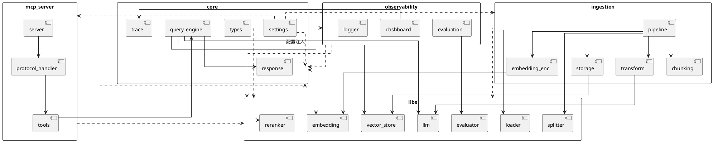

# Faya RAG 系统架构文档

本文档描述 Faya RAG 系统的整体架构设计，包含系统组件、数据流和模块依赖关系。

---

## 1. 系统整体架构

```mermaid
flowchart TB
    subgraph Client["客户端"]
        Claude["Claude / IDE"]
        Browser["浏览器"]
    end

    subgraph Interface["接口层"]
        Dashboard["Dashboard"]
        MCP["MCP Server"]
        HTTP["HTTP Server"]
    end

    subgraph Business["业务层"]
        subgraph Engine["核心引擎"]
            QP["Query Processor"]

            subgraph Retrieve["并行检索"]
                DR["Dense Retriever"]
                SR["Sparse Retriever"]
            end

            RRF["RRF Fusion"]
            RR["Reranker"]
            CG["Citation Generator"]
        end

        subgraph Pipeline["数据处理"]
            Load["加载"]
            Chunk["分块"]
            Transform["转换"]
            Encode["编码"]
            Store["存储"]
        end
    end

    subgraph Infra["基础设施层"]
        direction LR
        subgraph Providers["服务提供商"]
            LLM["LLM"]
            Emb["Embedding"]
            Vision["Vision"]
        end

        subgraph Storage["数据存储"]
            Chroma[(ChromaDB)]
            BM25[(BM25)]
            SQLite[(SQLite)]
            Image[(图片)]
        end
    end

    ' 强制层次：从上到下
    Client ~~~ Interface
    Interface ~~~ Business
    Business ~~~ Infra

    ' 实际连接
    Claude --> Dashboard
    Browser --> Dashboard

    Dashboard --> Load
    Dashboard --> QP
    MCP --> QP
    HTTP --> QP

    QP --> DR
    QP --> SR
    DR --> RRF
    SR --> RRF
    RRF --> RR
    RR --> CG

    Load --> Chunk
    Chunk --> Transform
    Transform --> Encode
    Encode --> Store

    style Client fill:#f5f5f5
    style Interface fill:#e3f2fd
    style Business fill:none,stroke:none
    style Engine fill:#e8f5e9
    style Pipeline fill:#fff3e0
    style Infra fill:none,stroke:none
    style Providers fill:#fce4ec
    style Storage fill:#e0f2f1
```

---

## 2. 查询流程数据流

```plantuml
@startuml
skinparam sequenceArrowThickness 2
skinparam sequenceParticipantBackgroundColor #e3f2fd

actor "MCP Client" as Client
participant "MCP Server" as Server
participant "Query Processor" as QP
participant "Dense Retriever" as DR
participant "Sparse Retriever" as SR
participant "RRF Fusion" as RRF
participant "Reranker" as RR
participant "Citation Generator" as CG

database "Vector Store\n(ChromaDB)" as VS
database "BM25 Index" as BM25

Client -> Server: query_knowledge_hub(query)
activate Server

Server -> QP: process(query)
activate QP
QP --> Server: ProcessedQuery\n(keywords, filters)
deactivate QP

par 并行检索
    Server -> DR: retrieve(query)
    activate DR
    DR -> VS: similarity_search(embedding)
    VS --> DR: dense_results
    DR --> Server: dense_results
    deactivate DR

and
    Server -> SR: retrieve(keywords)
    activate SR
    SR -> BM25: bm25_search(keywords)
    BM25 --> SR: sparse_results
    SR --> Server: sparse_results
    deactivate SR
end

Server -> RRF: fuse(dense_results, sparse_results)
activate RRF
RRF --> Server: fused_results
deactivate RRF

alt 启用 Rerank
    Server -> RR: rerank(fused_results)
    activate RR
    RR --> Server: reranked_results
    deactivate RR
end

Server -> CG: generate_citations()
activate CG
CG --> Server: response with citations
deactivate CG

Server --> Client: 返回结果
deactivate Server

@enduml
```

---

## 3. 摄取流程数据流

```plantuml
@startuml
skinparam defaultTextAlignment center
skinparam activityBackgroundColor #fff3e0
skinparam activityBorderColor #f57c00

start
:PDF File;

if (SHA256\n已处理?) then (是)
  :跳过;
  stop
else (否)
endif

:PDF Loader\n提取文本+图片;

:Document Chunker\n递归分块;

fork
  :Chunk Refiner\n分块优化;
fork again
  :Metadata Enricher\n元数据丰富;
fork again
  :Image Captioner\n图片描述;
end fork

:Batch Processor;

fork
  :Dense Encoder\n稠密向量编码;
  :Vector Upserter\nChromaDB;
  database ChromaDB
fork again
  :Sparse Encoder\nBM25编码;
  :BM25 Indexer;
  database BM25
fork again
  :Image Storage;
  database 图片
end fork

:标记成功;

stop

@enduml
```

---

## 4. 模块依赖关系



---

## 5. 目录结构

```
/Users/lyn/Desktop/faber-rag/
├── config/
│   └── settings.yaml              # 主配置文件
├── src/
│   ├── core/                      # 核心引擎
│   │   ├── settings.py            # 配置加载与验证
│   │   ├── types.py               # 类型定义
│   │   ├── query_engine/          # 查询引擎
│   │   │   ├── hybrid_search.py   # 混合检索主入口
│   │   │   ├── dense_retriever.py # 稠密检索
│   │   │   ├── sparse_retriever.py# 稀疏检索
│   │   │   ├── fusion.py          # RRF 融合
│   │   │   ├── reranker.py        # 重排序
│   │   │   └── query_processor.py # 查询预处理
│   │   ├── response/              # 响应构建
│   │   │   ├── citation_generator.py
│   │   │   └── multimodal_assembler.py
│   │   └── trace/                 # 链路追踪
│   │       └── trace_context.py
│   ├── libs/                      # 基础组件库
│   │   ├── llm/                   # LLM 工厂与实现
│   │   │   ├── llm_factory.py
│   │   │   ├── base_llm.py
│   │   │   ├── openai_llm.py
│   │   │   ├── qwen_llm.py
│   │   │   ├── deepseek_llm.py
│   │   │   └── qwen_vision_llm.py
│   │   ├── embedding/             # Embedding 工厂
│   │   │   ├── embedding_factory.py
│   │   │   ├── openai_embedding.py
│   │   │   └── qwen_embedding.py
│   │   ├── vector_store/          # 向量存储工厂
│   │   │   ├── vector_store_factory.py
│   │   │   └── chroma_store.py
│   │   ├── reranker/              # 重排序器
│   │   ├── loader/                # 文档加载器
│   │   ├── splitter/              # 文本切分器
│   │   └── evaluator/             # 评估器
│   ├── ingestion/                 # 摄取管道
│   │   ├── pipeline.py            # 主编排器
│   │   ├── chunking/              # 分块
│   │   ├── transform/             # 转换
│   │   ├── embedding/             # 编码
│   │   └── storage/               # 存储
│   ├── mcp_server/                # MCP 服务器
│   │   ├── server.py              # 主入口
│   │   ├── protocol_handler.py    # 协议处理器
│   │   ├── http_server.py         # HTTP 服务
│   │   └── tools/                 # MCP 工具
│   └── observability/             # 可观测性
│       ├── dashboard/             # Streamlit 仪表盘
│       ├── evaluation/            # 评估
│       └── logger.py              # 日志
├── data/                          # 数据存储
│   ├── db/                        # 数据库
│   │   ├── chroma/               # ChromaDB 向量库
│   │   ├── bm25/                 # BM25 索引
│   │   └── image_index.db        # 图片索引
│   └── images/                    # 图片存储
└── scripts/                       # 脚本工具
    ├── ingest.py                  # 文档摄取
    ├── query.py                   # 查询测试
    └── evaluate.py                # 评估运行
```

---

## 6. 核心特性

### 6.1 混合检索 (Hybrid Search)

- **稠密检索**: 基于 Embedding 的语义相似度搜索
- **稀疏检索**: 基于 BM25 的关键词匹配
- **RRF 融合**: 使用倒数排名融合 (Reciprocal Rank Fusion) 组合结果
- **优雅降级**: 任一检索路径失败时自动回退到另一路径

### 6.2 摄取管道 (Ingestion Pipeline)

6 阶段处理流程:

1. **文件完整性检查** - SHA256 去重，支持增量处理
2. **文档加载** - PDF 文本提取 + 图片提取
3. **分块** - 可配置的文本切分策略
4. **转换** - 分块优化、元数据丰富、图片描述
5. **编码** - 稠密向量 + 稀疏向量批量编码
6. **存储** - 向量存储 + BM25 索引 + 图片存储

### 6.3 多提供商支持

| 类型 | 支持的提供商 |
|------|-------------|
| LLM | OpenAI, Azure, Ollama, DeepSeek, Qwen(通义千问) |
| Embedding | OpenAI, Azure, Ollama, Qwen |
| Vision LLM | OpenAI, Qwen-VL |
| Vector Store | ChromaDB, Qdrant, Pinecone |

### 6.4 MCP 协议支持

- 基于官方 MCP SDK 实现
- 支持 stdio 和 HTTP 传输
- 提供标准化工具接口:
  - `query_knowledge_hub` - 知识库查询
  - `list_collections` - 列出集合
  - `get_document_summary` - 获取文档摘要

### 6.5 可观测性

- **Streamlit Dashboard** - 6 个功能页面
  - 系统总览
  - 数据浏览
  - 文档处理
  - 查询历史
  - 评估面板
  - MCP 查询
- **链路追踪** - 完整的查询执行追踪
- **结构化日志** - JSON 格式日志输出

---

## 7. 配置驱动设计

所有组件通过 `config/settings.yaml` 配置:

```yaml
llm:
  provider: "qwen"
  model: "qwen-plus"

embedding:
  provider: "qwen"
  model: "text-embedding-v3"

vector_store:
  provider: "chroma"

retrieval:
  dense_top_k: 20
  sparse_top_k: 20
  fusion_top_k: 10

ingestion:
  chunk_size: 200
  chunk_overlap: 20
  chunk_refiner:
    use_llm: true
  metadata_enricher:
    use_llm: true
```

---

*文档生成时间: 2026-03-29*
